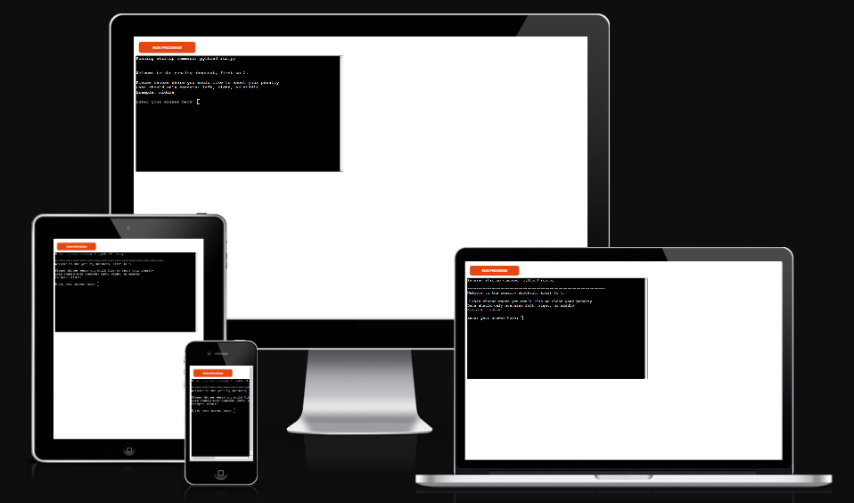
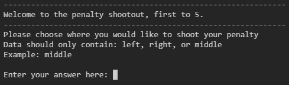
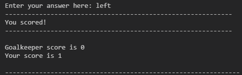
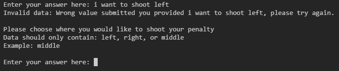

# Penalty shootout, first to 5

## Welcome!
[View the live project here](https://penalty-shootout-first-to-5-21972da03e60.herokuapp.com)

Penalty Shootout, first to 5 is a simple Python game where you compete against a computer goalkeeper in a penalty shootout. The objective of the game is to score more goals than the goalkeeper saves. The game follows a "first to 5" format, where the first player to reach 5 points wins the game.

# How to play
  1. The objective is to score more goals than the computer-controlled goalkeeper saves.
  2. The game follows a "first to 5" format, meaning the first player to reach 5 points wins.
  3. You will be prompted to choose where you want to shoot your penalty: left, right, or middle.
  4. Enter your choice by typing it in the provided input field.
  5. If your input is not one of the valid options (left, right, or middle), you will receive an error message and can try again.
  6. After you make your choice, the computer-controlled goalkeeper will also make a random decision.
  7. If your shot direction matches the goalkeeper's save, it will be considered a saved penalty.
  8. If your shot direction differs from the goalkeeper's save, it will be counted as a scored goal.
  9. The game keeps track of both your score and the goalkeeper's score.
  10. The process continues until either you or the goalkeeper reaches a score of 5.
  11. If you reach a score of 5 first, you will be declared the winner.
  12. If the goalkeeper reaches a score of 5 first, the game ends, and you lose.
  13. The final result will be displayed, indicating whether you won or lost.
  14. Enjoy the game and strive to become the penalty shootout champion by outscoring the goalkeeper!

# Features

## Existing Features

* ### User Input
  * The user can input where they would like to shoot.

* ### Random goalkeeper save generation
  * The computer randomly chooses in which direction to save.

* ### Score System
  * A user score system to track the user score.
  * A goalkeeper score system to track the goalkeeper score.

* ### Input validation and error-checking
  * The game only accepts specific input choices. The valid options are "left," "right," or "middle" representing the directions to shoot the penalty. Any other input will trigger an error message.
  * The input validation is case-insensitive, meaning that both uppercase and lowercase variations of the valid choices are accepted. For example, "LEFT," "Left," and "left" will all be considered as valid inputs.
  *  If the user provides an invalid input, an error message is displayed, informing them of the incorrect input and prompting them to try again.

## Future Features
* ### Introduce Difficulty Levels:
   * Categorize the game into difficulty levels such as Easy, Medium, and Hard.
   
# Testing

## Full Testing
Full testing was performed on the following terminals:
  * My local gitpod terminal
  * Heroku terminal

| `Feature` | `Expected Outcome` | `Testing Performance` | `Result` | `Pass/Fail`|
| ----------|--------------------|-----------------------|----------|------------|
| `Input`  | |
| Input       | When inputting a input user is expected to get a respone  | Added a valid input  |  Got a response  | Pass |
|  | | | | |
| `Goal Check` |  |
| Goal  | When inputting an input that's not the same as the goalkeepers the user is expected to score  | Choose an input that's not the same as the keepers   | Goal is scored  | Pass |
| Goalkeeper save | When inputting an input that's the same as the goalkeepers the goalkeeper is expected to save  | Choose an input that's the same as the keepers  | The goalkeeper saved the shot     | Pass |
| | | | | |
| `Score System` |
| User score | When the user scored the user expects the score to go up by 1 point | User scored | Score goes up by 1 point  | Pass |
| Goalkeeper saves | When the goalkeeper saves the user expects the keepers score to go up by 1 point | Goalkeeper saves | Goalkeeper score goes up by 1  | Pass |
| | | | | |
| `User input validation` |
| Invalid input |When an invalid input was added user is expected to be notified | Invalid input added | User gets a error message and with a option to try again  | Pass |
| Valid input |When a valid input was added user is expected to know if they scored or not | Valid input added | User gets feedback if they scored or not  | Pass |
| | | | | |

### Bugs
* Score is not updating until the next button is clicked.

#### Solved Bugs
* I could choose the same option every time and always score this happened because computerChoice = random.choice(options) was happening outside of the while loop so it would never randomize a new choice.
Once I added it to the while loop it was randomizing a new choice every time.

## Validation Testing
* PEP8
  * No errors were returned from https://pep8ci.herokuapp.com

# Technologies Used

## Frameworks, Libraries & Progams Used
  * [Gitpod](https://gitpod.io) was used to write the code and push to github.
  * [GitHub](https://github.com) was used to store the project code after being pushed from gitpod.
  * [ChatGPT](https://chat.openai.com) was used to improve copyright in the readme.
  * [Heroku](https://heroku.com) was used to deploy the project.
 ## Languages Used
 * Python

# Deployment
* The site was deployed to Heroku. The steps to deploy are as follows:
  * Fork or clone this respository
  * Create a new app on Heroku
  * Set the build backs to Python and NodeJS in that order
The live link can be found here - [Penalty shootout game](https://penalty-shootout-first-to-5-21972da03e60.herokuapp.com)

# Credits
  * Code Institute for the deployment terminal